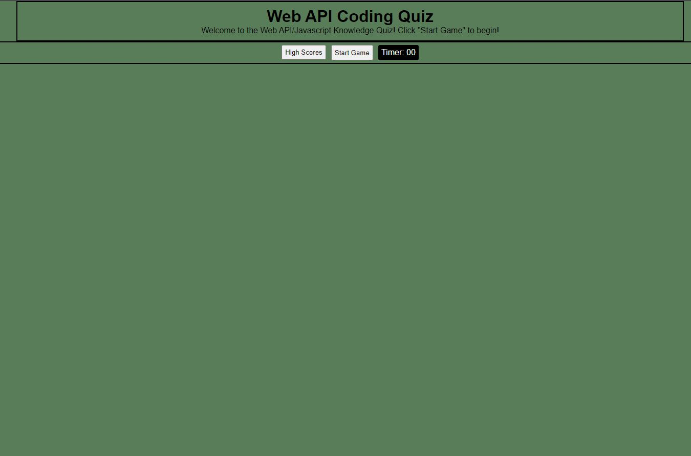
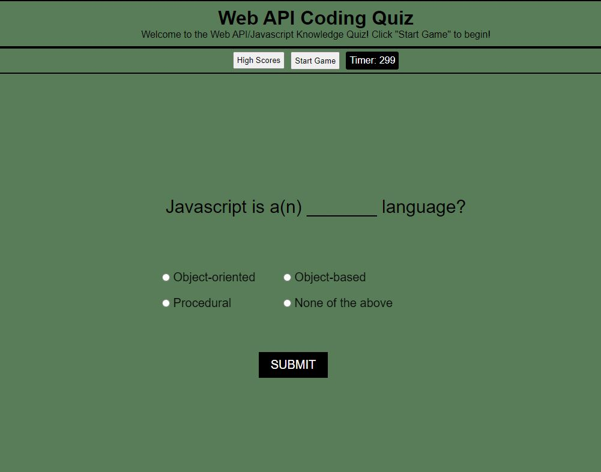
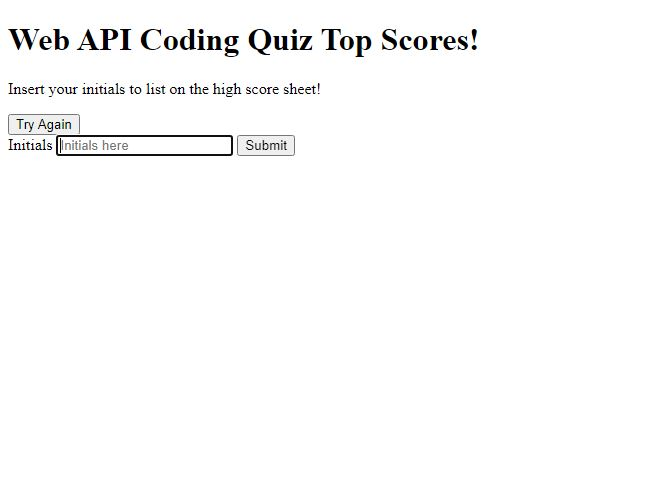
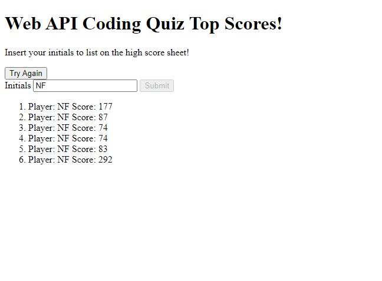

# Quiz Game

## NAME
The name of this webpage is Coding Knowledge Challenge.

## DESCRIPTION
This webpage is designed to display a quiz on Javascript knowledge. Upon completion of the quiz, the user will directed to the highscores page, where they can submit their initials and see their score in the leaderboard. 

## PROGRAMS USED
I used HTML and CSS to create the header and nav contents of this webpage and javascript to create the quiz content. Git/Github were used as version control and deployed to Github Pages.

## INSTALLATION
This is a website only and does not need installation. it is currently hosted in github and you can access it at Github; XX

## USAGE
This webpage is used to take a quiz on Javascript knowledge and submit their score and initials to the leaderboard. See webpage below:

You can click on "High Scores" which will send the user to the high scores webpage (seen later in this description), a "Start Game" button, which will begin the quiz, and a timer, which will display the time remaining during the quiz. Upon clicking "Start Game" a question will appear, as seen below:

Upon answering a question correctly, the user will be advanced to the next question. If a question is answered incorrectly, the time remaining will be deducted a set amount per question. After advancing through all questions, the user will be presented with the high scores page, as seen below:

Upon submitting the user's initials, their score will be recorded onto the leaderboard, as seen below:

As seen on the high scores page, the user can select the "Try Again" button to be re-directed back to the quiz webpage to begin the quiz again.

## SUPPORT AND CONTRIBUTION
If you have any questions or concerns, please reach out to nfailor@gmail.com

## AUTHORS AND ACKNOWLEDGEMENT
I am Nick Failor, the author of this project.

## LICENSE
N/A